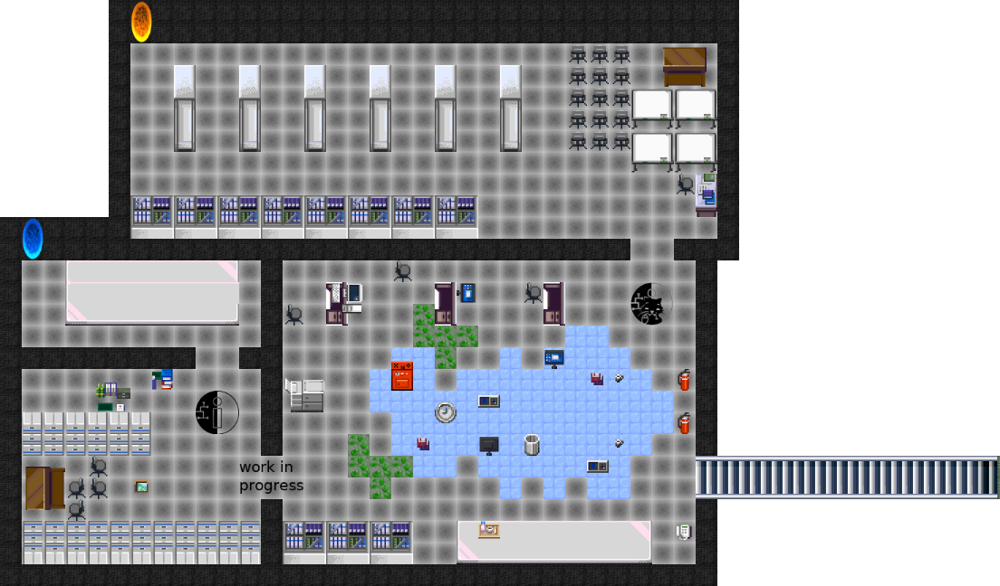

# WorkAdventure Map for Das-Labor

A map for [WorkAdventure](https://workadventu.re) showing 
[Das Labor](https://das-labor.org) in Bochum.

https://virtuallab.das-labor.org/

## EG

## UG

## Tools you will need

In order to build your own map for WorkAdventure, you need:

- the [Tiled editor](https://www.mapeditor.org/) software
- "tiles" (i.e. images) to create your map (this starter kit provides a good default tileset for offices)

## Customizing the map

You find the main map in `main.json`. You can open and edit
it with the [Tiled](https://www.mapeditor.org/) editor.

After push it will be deployed to branch `gh-pages` and made available to
github pages.

The page leading to the workadventure-room is
https://das-labor.github.io/workadv_das-labor/

Feel free to make pull requests.

### About WorkAdventu.re maps

In order to design a map that will be readable by WorkAdventure, you will have to respect some constraints.

In particular, you will need to:

- set a start position for the players
- configure the "floor layer" (so that WorkAdventure can correctly display characters above the floor, but under the ceiling)
- eventually, you can place exits that link to other maps

All this is described in the [WorkAdventure documentation](https://workadventu.re/create-map.html#about-workadventu-re-maps).
Please be sure to check it out. 

## Related Links

- fediventure: [repo](https://gitlab.com/fediventure/fediventure), [pad](https://pad.inf.re/p/fediventure)
- [rc3 overview](https://miro.com/app/board/o9J_laWLPI8=/)
- [rc3 World dump](https://github.com/rC3XBill/rC3World)
- [rc3 world images](https://archive.org/details/rc3_complete/)
